## 📄 Especificação Técnica Suplementar — Consulta de Previsão do Tempo

### 1. 🎯 Objetivo
Permitir que o usuário pesquise a previsão do tempo para uma cidade, exibindo dados atuais e a previsão para os próximos dias de forma clara, validando o input e tratando os diferentes estados da requisição.

---

### 2. ⚙️ Descrição Geral da Regra
A funcionalidade permite que o usuário insira o nome de uma cidade, valide o input, realize uma requisição à API da OpenWeatherMap, trate e formate os dados recebidos, e apresente essas informações na interface de forma organizada. Em caso de erro (como cidade não encontrada), mensagens adequadas são exibidas.

---

### 3. 🔁 Fluxo de Dados

```mermaid
graph TD
  UI[Input do Usuário] -->|Cidade digitada| validateSearchInput
  validateSearchInput -->|Input válido| fetchWeather
  fetchWeather -->|Resposta da API| groupForecastByDay
  groupForecastByDay --> transformGroupedForecast
  transformGroupedForecast -->|Previsão formatada| WeatherDashboard
  WeatherDashboard -->|Props| WeatherForecastCard
```

---

### 4. 🧠 Regras de Validação
- O campo de busca **não pode estar vazio**.
- A entrada é normalizada com `trim()` antes de ser enviada.
- Caso o input seja inválido, um `toast` de aviso é exibido.
- Caso a API retorne erro (ex: 404), outro `toast` específico é exibido.

---

### 5. 🔄 Tratamento de Estados

| Estado | Comportamento |
|--------|----------------|
| Carregamento (`isLoading`) | Exibe indicador de loading no botão ou overlay |
| Sucesso | Renderiza cards com dados formatados |
| Erro (ex: cidade inválida) | Exibe `toast` informando o erro |
| Dados vazios | O componente não renderiza cards de previsão |

- Cache: A resposta da API é armazenada com React Query (`QueryClient`), permitindo **revalidação automática** com base em `staleTime`.

---

### 6. 🧩 Integrações e Dependências

| Item | Descrição |
|------|-----------|
| API externa | [OpenWeatherMap](https://openweathermap.org/) |
| Endpoint | `/forecast?q={city}&units=metric&appid={API_KEY}` |
| Funções principais | `fetchWeather`, `validateSearchInput` |
| Lógica de agrupamento | `groupForecastByDay`, `transformGroupedForecast` |
| Formatação de data/hora | `getShortWeekdayName`, `formatToLocalTime` |
| Hooks usados | `useUserLocation`, `useQuery` do React Query |
| Componentes envolvidos | `WeatherDashboard`, `WeatherForecastCard`, `SearchInput`, etc. |

---

### 7. 🧪 Pontos de Teste Sugeridos

- ✅ Input em branco → deve exibir `toast` de aviso.
- ✅ Cidade válida → exibe dados corretamente.
- ✅ Cidade inválida → exibe `toast` de erro.
- ✅ Enquanto carrega → deve mostrar indicador visual.
- ✅ Após erro, dados anteriores devem permanecer visíveis.
- ✅ Forecast diário mostra temperatura mínima, máxima e ícone.
- ✅ Previsão aparece para até 5 dias (excluindo o atual).

---

### 8. 📎 Anexos
- ✔️ [Diagrama do Fluxo de Dados (PNG)](./assets/architecture-flowchart.png)
